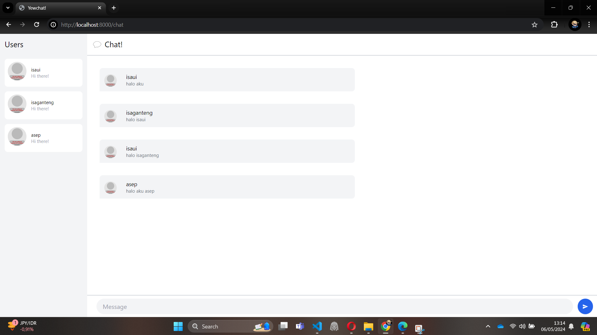

# YewChat 💬with isaui
## Cara Menjalankan
1. `cd SimpleWebsocketServer`
2. `npm i`
3. `npm start`
4. `cd ..`
5. `npm i`
6. `npm start`
7. Pergi ke localhost:8000
## Refleksi

Kita berhasil menjalankan yewchat di rust dengan bantuan websocket yang ditulis di javascript
