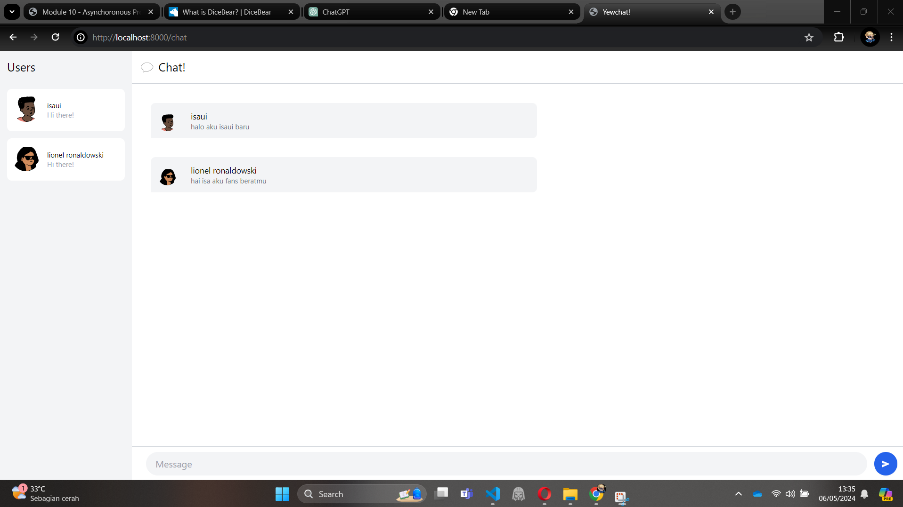

# YewChat 💬with isaui
## Cara Menjalankan
1. `cd SimpleWebsocketServer`
2. `npm i`
3. `npm start`
4. `cd ..`
5. `npm i`
6. `npm start`
7. Pergi ke localhost:8000
## Refleksi
### 1.1

Kita berhasil menjalankan yewchat di rust dengan bantuan websocket yang ditulis di javascript
### 1.2

Ini kreativitas saya, menambahkan profile picture random untuk user yang membuat koneksi websocket baru. Hal ini dilakukan dengan menembak api `https://api.dicebear.com/8.x/open-peeps/svg?seed=USERNAME`
